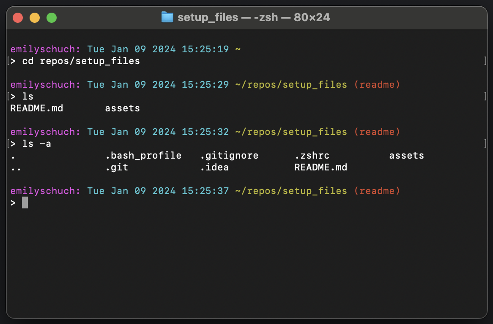

# Setting up a new Data Science Development Environment

I recently needed to set up my development environment on a new computer after not having done so in some time and wanted
to save the steps I followed here for the next time I need to set up a new machine. I used 
[this walkthrough](https://engineeringfordatascience.com/posts/setting_up_a_macbook_for_data_science/) 
with some modifications based on my own preferences.

## Terminal Setup
I prefer to use the old-school default terminal, but with a bunch of custom modifications for things like coloring the
prompt, dynamically displaying and coloring the git branch according to status, and adding new lines so that it's easier
to parse through outputs and commands.

The `.bash_profile` file contains my old preferences for terminal setup, which I've translated for using `zshell` in the
`.zshrc` file, since that is now the standard terminal on modern Macs.

1. Check if there is already a `.zshrc` file created on your machine by typing `open ~.zshrc` in the terminal
2. If you receive an error that the file does not exist, create it with the command `touch ~.zshrc` and then use the
`open ~.zshrc` command again to open it
3. Add whatever styling you like. In my case, lines 1 through 17 in my `.zshrc` file are all for styling in the terminal
4. Save and close the `.zshrc` file and restart the terminal to see the changes reflected

This is what my terminal looks like in a git directory with unstaged changes on a branch called `readme`.


## Install a System Package Manager
Install [Homebrew](https://brew.sh/), the most popular package manager for macOS, using this command from the terminal:
```commandline
/bin/bash -c "$(curl -fsSL https://raw.githubusercontent.com/Homebrew/install/HEAD/install.sh)"
```

Following installation, you may see some prompts to add Homebrew to your `PATH` variable.
Follow the prompts and this will allow you to use the `brew` command to install packages.

## Setup Git

[Git](https://git-scm.com/) is your version control system, but you possibly already know that since you're reading this on GitHub. 
Install git using Homebrew with the command:
```commandline
brew install git
```
Once installed, set up your global identity with your own name and email:
```commandline
git config --global user.name "John Doe"
git config --global user.email johndoe@example.com
```
You can also set up other defaults such as your preferred text editor. See the documentation for [First-Time Git Setup](
https://git-scm.com/book/en/v2/Getting-Started-First-Time-Git-Setup).

You will likely also want to set up a remote connection from your machine to your GitHub account using an SSH key.
Follow the instructions in the [GitHub Docs](https://docs.github.com/en/authentication/connecting-to-github-with-ssh/checking-for-existing-ssh-keys)
to check for an existing SSH key, generate a new one, and add the key to your machine.

## Setup Python and Virtual Environments

Python comes pre-installed on Macs, but using your machine's system version of python can get incredibly messy,and potentially
dangerous, so it's better not to touch the system version of python at all. Don't upgrade the python version, don't install 
packages, just create virtual environments instead. It's so much cleaner and will also save you headaches if you have old 
projects and newer projects that have clashing version requirements for specific packages.

### Install and set up `pyenv`

You can install [pyenv](https://github.com/pyenv/pyenv?tab=readme-ov-file#homebrew-in-macos) with Homebrew.
```commandline
brew install pyenv
```
Then [set up the shell environment for pyenv](https://github.com/pyenv/pyenv?tab=readme-ov-file#set-up-your-shell-environment-for-pyenv).
For zshell that looks like this:
```commandline
echo 'export PYENV_ROOT="$HOME/.pyenv"' >> ~/.zshrc
echo '[[ -d $PYENV_ROOT/bin ]] && export PATH="$PYENV_ROOT/bin:$PATH"' >> ~/.zshrc
echo 'eval "$(pyenv init -)"' >> ~/.zshrc
```
So the lines of code in my `.zshrc` file were added with these lines of code after installation.

### Using `pyenv`

You can check the versions of python installed on your machine with the command
```commandline
# list available python versions
pyenv versions
```
Running this will likely show you only the system version of python installed, which we shouldn't touch.
To install an additional version of python, you can run a command like this:
```commandline
# install separate python version 3.12.0
pyenv install 3.12.0

# list versions again
pyenv versions
```
I'm using version 3.12.0 here because it's one of the most recent versions at the time that I'm writing this, but if you 
need to install a different version, you can find the supported releases in the [python version documentation](
https://www.python.org/doc/versions/).

Now lets change the global version of python for our machine to the newly installed version, rather than the system version.
```commandline
# set default version to newly installed 3.12.0
pyenv global 3.12.0

# list versions again
pyenv versions
```

Now you should see a star next to the newly installed version rather than the system version, indicating that it's the default.

### Install `pyenv-virtualenv` for Virtual Environment Management

You can use `venv` which is built into `pyenv`, but I prefer `virtualenv` for managing virtual environments.

```commandline
# install pyenv-virtualenv plugin
brew install pyenv-virtualenv

# add a new line to your to .zshrc
echo 'eval "$(pyenv virtualenv-init -)"' >> ~/.zshrc
```

### Using `pyenv-virtualenv`

Now you can navigate to a project, create a virtual environment, and activate it. When you want to change to a different 
environment, or you're done working on the project, deactivate your virtual environment. It's still there, it's just not active.

Here I'm creating a virtual environment called `ds_env`, but ideally you will want to create a separate environment for
each unique project.

```commandline
# create a new virtualenv (e.g. pyenv virtualenv <python-version> <env-name>)
pyenv virtualenv 3.12.0 ds_env

# activate the virtualenv
pyenv activate ds_env

# list all available virtual environments
pyenv virtualenvs

# deactivate the virtualenv
pyenv deactivate ds_env
```

## Install Jupyter Lab with `requirements.txt`

Creating a virtual environment and using a `requirements.txt` file to install all of your packages in that environment
means that your code should JustWork™. Ideally, you will want to pin the package versions in your requirements file. This
means that if you need to upgrade a package for one project, all the other projects on your machine don't suddenly stop
working because the code was written for a legacy version.

Create and open your requirements file:
```commandline
# create a requirements file
touch requirements.txt

# open the file
open requirements.txt
```
Now add a few packages to the file:
```
juptyerlab
pandas
numpy
```
Making sure that you are in your virtual environment for the project, install the requirements in that environment:
```commandline
# activate the virtual environment
pyenv activate ds_env

# install requirements
pip intall -r requirements.txt
```
This will install the latest, greatest versions of any packages you've added to the requirements. If you want to pin the
specific versions, run `pip freeze` in the command line to see what is installed. You'll see more than just the few packages
you just installed, since many packages have dependencies. To pin the versions, update the requirements file with the version
numbers you see when you run `pip freeze`:
```
jupyterlab==4.0.10
pandas==2.1.4
numpy==1.26.3
```
If you uncover any additional packages you need as you work on a project, just add them to the requirements file and install
again. For packages that were previously installed, you'll get the response `Requirement already satisfied`. When installing
additional packages, you may need to restart your jupyter kernel or python environment for them to be available for import.

## Install a Code Editor

It can be useful to have a full IDE code editor installed. I've chosen to use [PyCharm](https://www.jetbrains.com/pycharm/),
but I'm new to it and will add more detail on best practices and additional set up as I work with it more.

The full developer package costs money, but there is also a free [PyCharm Community Edition](
https://www.jetbrains.com/pycharm/download/?section=mac) if you scroll down the page.

I'll explore some features and plugins like linters and code completion and add more here.

## Create a Global `.gitignore` file

If you're already familiar with git, you may also be familiar with the `.gitignore` file - the file you add things to that
you don't want git to track or upload to GitHub. In many cases, that might be dependent on the repository, but in terms of
many of the packages we just installed, some of them create artifacts that we will *always* want to ignore (for example, 
`.ipynb_checkpoints` created by jupyter, and many of the artifacts created by PyCharm). 

For this, we should create a Global `.gitignore` file in our home directory.

```commandline
# create global gitignore
touch ~/.gitignore

# open the file
open ~/.gitignore
```
You can find [Global gitignore templates](https://github.com/github/gitignore/tree/main/Global) for various types of files
depending on what packages, tools, or plugins you're using. I've added the [JetBrains template](https://github.com/github/gitignore/blob/main/Global/JetBrains.gitignore)
to mine to ignore most PyCharm artifacts, along with the [Jupyter Notebook template](https://github.com/github/gitignore/blob/main/community/Python/JupyterNotebooks.gitignore) 
and a few other things like `.DS_Store`. 

Only add things to the global file that you want to ignore in *every* repository
and use the repo's `.gitignore` file to ignore any files specific to that project. For example, in some projects I may want
to ignore `*.jpg`, `*.jpeg`, or `*.png` files, but not in every repo. For example, I'm using a `.png` file in this README
file.

For my machine to recognize this global file, I need to add it to the git config:
```commandline
git config --global core.excludesfile ~/.gitignore
```

# My Data Science Workflow

Now my machine is set up! 🕺

For each unique data science project, I can now follow this workflow:
1. Create a new GitHub directory
2. Clone the repo to my machine
3. Navigate to the directory, create and start a virtual environment
4. Create a `requirements.txt` file in the root directory and add any dependent python packages
5. Install the required packages to my virtual environment
6. Conduct analysis or development in the repo
7. Commit and push to GitHub throughout development and once the code is complete
8. Deactivate the virtual environment

Saving this info here so that the next time I need to set up a new machine, it will be easy and fast 🚀
